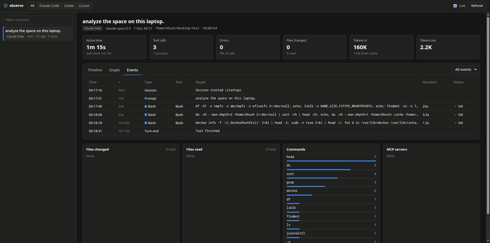
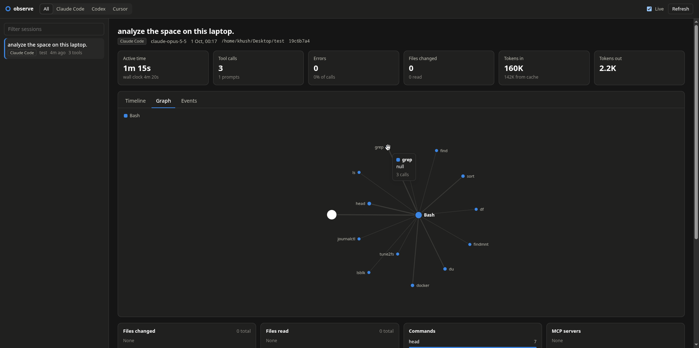
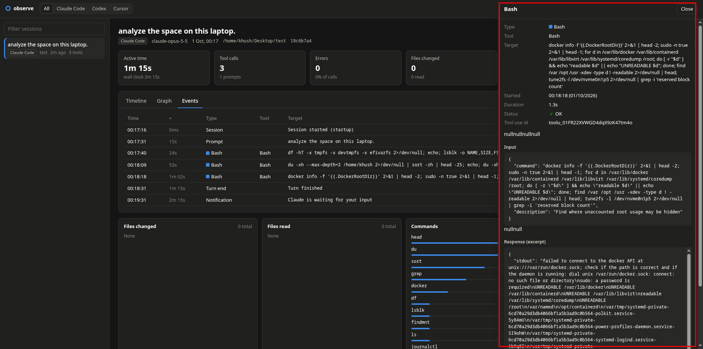

<div align="center">

# hooklens

**See what your coding agent actually did.**

Every tool call, shell command, file change, MCP call, and token, from Claude Code, Codex, and Cursor.
On a timeline and a graph, on your machine.

[](https://github.com/Kunal-5402/hooklens/actions/workflows/ci.yml)
[](https://pypi.org/project/hooklens/)
[](pyproject.toml)
[](LICENSE)



</div>

## Why hooklens

Coding agents run commands, edit files, and call tools faster than you can read the transcript.
hooklens records what happened through the agents' own hooks, so you can answer questions like:

- Which files did the agent change, and which did it only read?
- What shell commands ran, and which ones failed?
- Which MCP servers and tools did it use?
- Where did the time go, and how many tokens did the session cost?

It is a single Python package with **no dependencies**. Data stays in a local SQLite file, and the
UI is a local web page. **Nothing leaves your machine.**

## Features

- **Timeline** of every tool call, with duration and status. Long idle gaps are compressed.
- **Graph** of the session: tools, programs, files, MCP servers, and how often each was used.
- **Event log** with the input and a response excerpt of every call.
- **Summary** of files changed, files read, commands, and MCP servers.
- **Tokens and model** from the agent's transcript.
- **Live view** that updates while the agent works.
- **One view for three agents.** Claude Code, Codex, and Cursor events are normalized to one schema.

## Supported agents

| Agent | Tool calls | Prompts and turns | Tokens | Hooks file |
|---|:---:|:---:|:---:|---|
| Claude Code | ✅ | ✅ | ✅ | `~/.claude/settings.json` |
| Codex | ✅ | ✅ | ✅ | `~/.codex/hooks.json` |
| Cursor | ✅ | ✅ | — | `~/.cursor/hooks.json` |

## Quick start

```sh
uv tool install hooklens        # or: pipx install hooklens
hooklens install                # add hooks to every agent it finds
```

Start a **new** agent session (hooks load when a session starts), use the agent, then run:

```sh
hooklens show                   # opens http://127.0.0.1:7878
```

To install one agent at a time, use `hooklens claude install`, `hooklens codex install`, or
`hooklens cursor install`.

## Usage

| Command | What it does |
|---|---|
| `hooklens show [session]` | Open the UI for all sessions, or one session |
| `hooklens <agent> show` | Open the UI for one agent (`claude`, `codex`, `cursor`) |
| `hooklens sessions` | List recent sessions in the terminal |
| `hooklens doctor` | Check the hooks, the database, and recent events |
| `hooklens clear` | Delete all recorded data (the hooks stay) |
| `hooklens uninstall` | Remove the hooks (your other hooks and settings stay) |
| `hooklens uninstall --purge` | Remove the hooks, the data, and the config backups |

Commands that delete data ask first. Add `--dry-run` to see what would be removed, or `--yes` to
skip the question.

<details>
<summary><b>More screenshots</b></summary>

The session graph: tools, the programs they ran, and the files they touched.



The details of one event, with its input and response.



</details>

## How it works

```
agent ──hook event (JSON)──> hooklens hook ──> SQLite (raw events)
                                                   │
                         hooklens show ──> normalize ──> sessions, events, files ──> local UI
```

1. **Capture.** The agent runs `hooklens <agent> hook` on each event. The hook stores the raw
   event and exits in about 30 ms. It never blocks or changes what the agent does.
2. **Normalize.** When you open the UI, hooklens maps each agent's events to one schema, pairs tool
   starts with their results, and reads token usage from the agent's transcript.
3. **View.** A small server on `127.0.0.1` serves the UI and a JSON API.

hooklens only uses hooks that report what happened. It never subscribes to hooks that can allow or
block an action. Read [design/architecture.md](design/architecture.md) for the details and
[design/sequence.md](design/sequence.md) for the full call flow.

## Privacy and safety

- All data is in `~/.hooklens/hooklens.db`. Nothing is sent over the network.
- Each string is trimmed to 4096 characters before it is stored, so full file contents and long
  outputs are not kept. Set `HOOKLENS_MAX_FIELD` to change the limit (`0` keeps everything).
- Cursor sends your account email with each event. hooklens removes it before storage.
- hooklens backs up an agent config file before it changes it, and only ever edits its own entries.
- `hooklens uninstall --purge` removes everything hooklens created, and nothing else.

## Configuration

| Variable | Default | Purpose |
|---|---|---|
| `HOOKLENS_HOME` | `~/.hooklens` | Where the database and error log live |
| `HOOKLENS_MAX_FIELD` | `4096` | Max characters stored per string (`0` = no limit) |
| `HOOKLENS_CLAUDE_SETTINGS` | `~/.claude/settings.json` | Claude Code settings file |
| `CODEX_HOME` | `~/.codex` | Codex config folder |
| `HOOKLENS_CURSOR_HOME` | `~/.cursor` | Cursor config folder |

## Roadmap

See the [milestones](https://github.com/Kunal-5402/hooklens/milestones): the first PyPI release,
importing past sessions, cost estimates, OpenTelemetry and SIEM export, and policy hooks for
security tools.

## Contributing

Contributions are welcome. Read [CONTRIBUTING.md](CONTRIBUTING.md) to get started.

```sh
make setup     # create .venv with the dev dependencies (needs uv)
make check     # lint, format check, and tests: the same checks as CI
```

<details>
<summary><b>Releasing (maintainers)</b></summary>

1. Set the same version in `pyproject.toml` and `src/hooklens/__init__.py`, and merge to `main`.
2. Publish a GitHub release with a SemVer tag: `v1.2.3`, or `v1.2.3-alpha.1`, `-beta.1`, `-rc.1`.
3. Approve the `pypi` deployment. The release workflow checks the tag, runs the tests, builds the
   package, and publishes it to PyPI.

</details>

## License

[Apache License 2.0](LICENSE). Copyright 2026 Kunal.
